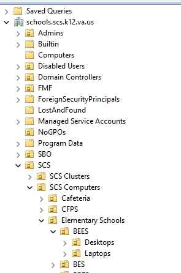

# README

This project will ingest CSV files form the Asset Management system and Active Directory. The Asset Management sysetm does not have a API that I'm aware of, but "reports" can be exported in CSV format. However, the CSV file has a lot of nonsenece specific to Excel. There are extranious equals and quotes in the data that are suppose to help Excel with type casting. This only confusses every other utility that is designed for CSV data exchange. 

## Inpurt Data Files
These are the source data files for the project.
### Laptops
The current file "laptopSCPS.tsv" was created using the GUI "Active Directory Users and Computers" utility. There are OUs for computers with in sub folders of SCS. The structure is SCS->SCS Computers->"Catigories"->"School Code". 

After installing the RSAT module on the laptop, the PowerShell script "Get-LaptopAD.ps1" was modified to collect information on all staff computers in the Elementary OU. It took about one to two minutes I believe.