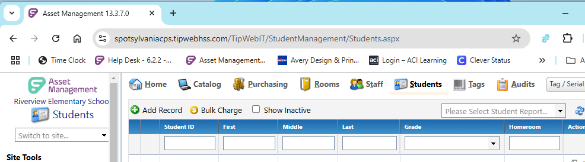
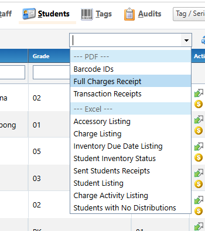

# Student Labels (Bar Code)

The asset management system generates a "Student Listing Report" that outputs a CSV file. The schema includes the "studentID, First, Middle, Last (names), Grade, Homeroom, and Student E-Mail". The export seems to be too smart by half, by adding formating to set the field types. Student ID, Grade and Homeroom wrap the data in quotes and precede the values with an equal sign "=". I beleve this is done to signify alpha fields for data that appears to be numberic. Perhapes this syntax is uesed for Excel, but it does not seem to be generaly excepted with Javascript libraries without some wrangling. ChatGPT AI suggestes a few [methods](./Docs/AI-Parse-CSV.md) for ingessting the data.

## Generate Student data

1. Select the "Student" tab in the Asset Mananement system: 
  
1. Select the "Student Listing" report in the context menu:  
  
1. Ingest the StudnetListing.csv file into the application (unknown method at this point)

## Import the data into a database

Both SQLite and DuckDB have node.js modules that can create and query databases. Observable has some cool features that allow easy use of DuckDB, however it appears that the DuckDBClient library is dependant on the Observable infrastructure. Ultimatly, the application will be run locally and not have access to cloud services other than Google Workspace. Obserable does have a "Framework" for local devleopment, that may be use with this application.

Start out with [SQLite](.\Docs\AI-Ingest-CSV-data-into-SQLite-DB.md) since inporting and creating a database appears to be similar between the two, and SQLite has been around forever and is used everywhere.  

...Whait a minute, maybe I can inport the [DuckDBClient library](https://observablehq.com/framework/lib/duckdb) 